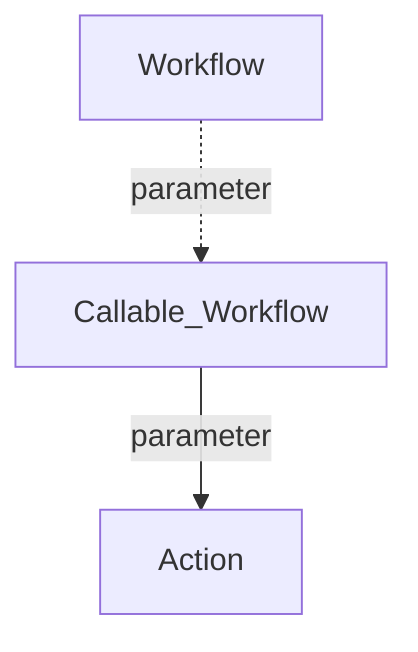

<div id="top" align="center">
<h1>GH Action doctoc</h1>

<p>GH Action to create Table of Contents in Markdonw files</p>

[Report Issue](https://github.com/Zheng-Bote/gha-doctoc/issues) [Request Feature](https://github.com/Zheng-Bote/gha-doctoc/pulls)

[](https://choosealicense.com/licenses/mit/)


</div>

<hr>

<!-- START doctoc generated TOC please keep comment here to allow auto update -->
<!-- DON'T EDIT THIS SECTION, INSTEAD RE-RUN doctoc TO UPDATE -->
**Table of Contents**

- [Description](#description)
  - [Features](#features)
- [Status](#status)
- [Installation](#installation)
  - [Dependencies](#dependencies)
- [folder structure](#folder-structure)
- [Usage/Examples](#usageexamples)
- [API Reference](#api-reference)
  - [Parameters](#parameters)
- [Documentation](#documentation)
  - [Github Page](#github-page)
- [Authors and License](#authors-and-license)
  - [License](#license)
  - [Authors](#authors)
  - [Code Contributors](#code-contributors)

<!-- END doctoc generated TOC please keep comment here to allow auto update -->

<hr>

# Description


Github Action generates table of contents for markdown files inside local git repository.

> \[!NOTE]
> Based on Node.js application [DocToc](https://github.com/thlorenz/doctoc) created by [Thorsten Lorenz](https://github.com/thlorenz) and 

## Features

- \[x] works as designed
- \[ ] no bugs

<p align="right">(<a href="#top">back to top</a>)</p>

# Status


<p align="right">(<a href="#top">back to top</a>)</p>

# Installation

- copy folder `doctoc` into `<your repo>.github/actions`
- create a workflow to use doctoc action (see example)

> [!Note]
> works also with GHES

## Dependencies

[DocToc](https://github.com/thlorenz/doctoc)

# folder structure

```
.github
├── actions
│   └── doctoc
│       ├── action.yml
│       ├── dist
│       │   ├── index.js
│       │   ├── index.js.map
│       │   ├── licenses.txt
│       │   └── sourcemap-register.js
│       └── README.md
└── workflows
    ├── repo-create_doctoc.yml
```

<p align="right">(<a href="#top">back to top</a>)</p>

# Usage/Examples

see `.github/workflows/repo-create_doctoc.yml`:

```yaml
name: Repo - create TOC of README
# description: https://github.com/thlorenz/doctoc

# README.md:
# <!-- START doctoc -->
# <!-- END doctoc -->

run-name: create README table of contents by ${{ github.actor }}

on:
  workflow_dispatch:
  push:
    branches:
      - "main"
    paths:
      - "README.md"

permissions:
  contents: write

jobs:
  generateTOC:
    name: TOC Generator
    runs-on: ubuntu-latest
    steps:
      - uses: actions/checkout@v4
        with:
          fetch-depth: 0
          ref: "main"

      - uses: ./.github/actions/doctoc
        with:
          GITHUB_TOKEN: ${{ secrets.GITHUB_TOKEN }}
          TARGET_PATHS: ./README.md
          FOLDING: false

      - name: Verify Changed files
        uses: tj-actions/verify-changed-files@v20
        id: verify_changed_files
        with:
          files: |
            README.md

      - name: README.md changed
        if: steps.verify_changed_files.outputs.files_changed == 'false'
        run: |
          echo "README.md has no uncommitted changes"
          exit 1

      - name: commit and push
        if: steps.verify_changed_files.outputs.files_changed == 'true'
        uses: github-actions-x/commit@v2.9
        with:
          github-token: ${{ secrets.GITHUB_TOKEN }}
          push-branch: "main"
          commit-message: "appended by Github Actions"
          force-add: "true"
          files: README.md
          name: "github-actions[bot]"
          email: "github-actions[bot]@users.noreply.github.com"
```

<p align="right">(<a href="#top">back to top</a>)</p>

# API Reference

## Parameters

> \[!IMPORTANT]
> Inputs support still in progress.

<p align="right">(<a href="#top">back to top</a>)</p>

# Documentation



## Github Page

[](https://www.github.com/Zheng-Bote)

see also: https://github.com/Zheng-Bote/gha-doctoc

<p align="right">(<a href="#top">back to top</a>)</p>

# Authors and License

## License

**MIT License**

- doctoc (see `dist` folder): Copyright 2013 Thorsten Lorenz.

- gha-doctoc (GH Action and Workflows): Copyright (c) 2024 ZHENG Robert

Permission is hereby granted, free of charge, to any person obtaining a copy
of this software and associated documentation files (the "Software"), to deal
in the Software without restriction, including without limitation the rights
to use, copy, modify, merge, publish, distribute, sublicense, and/or sell
copies of the Software, and to permit persons to whom the Software is
furnished to do so, subject to the following conditions:

The above copyright notice and this permission notice shall be included in all
copies or substantial portions of the Software.

THE SOFTWARE IS PROVIDED "AS IS", WITHOUT WARRANTY OF ANY KIND, EXPRESS OR
IMPLIED, INCLUDING BUT NOT LIMITED TO THE WARRANTIES OF MERCHANTABILITY,
FITNESS FOR A PARTICULAR PURPOSE AND NONINFRINGEMENT. IN NO EVENT SHALL THE
AUTHORS OR COPYRIGHT HOLDERS BE LIABLE FOR ANY CLAIM, DAMAGES OR OTHER
LIABILITY, WHETHER IN AN ACTION OF CONTRACT, TORT OR OTHERWISE, ARISING FROM,
OUT OF OR IN CONNECTION WITH THE SOFTWARE OR THE USE OR OTHER DEALINGS IN THE
SOFTWARE.

        https://choosealicense.com/licenses/mit/

## Authors

- [](https://www.github.com/thlorenz)
- [](https://www.github.com/Zheng-Bote)

## Code Contributors


[](https://www.github.com/Zheng-Bote)

<hr>

:vulcan_salute:

<p align="right">(<a href="#top">back to top</a>)</p>
