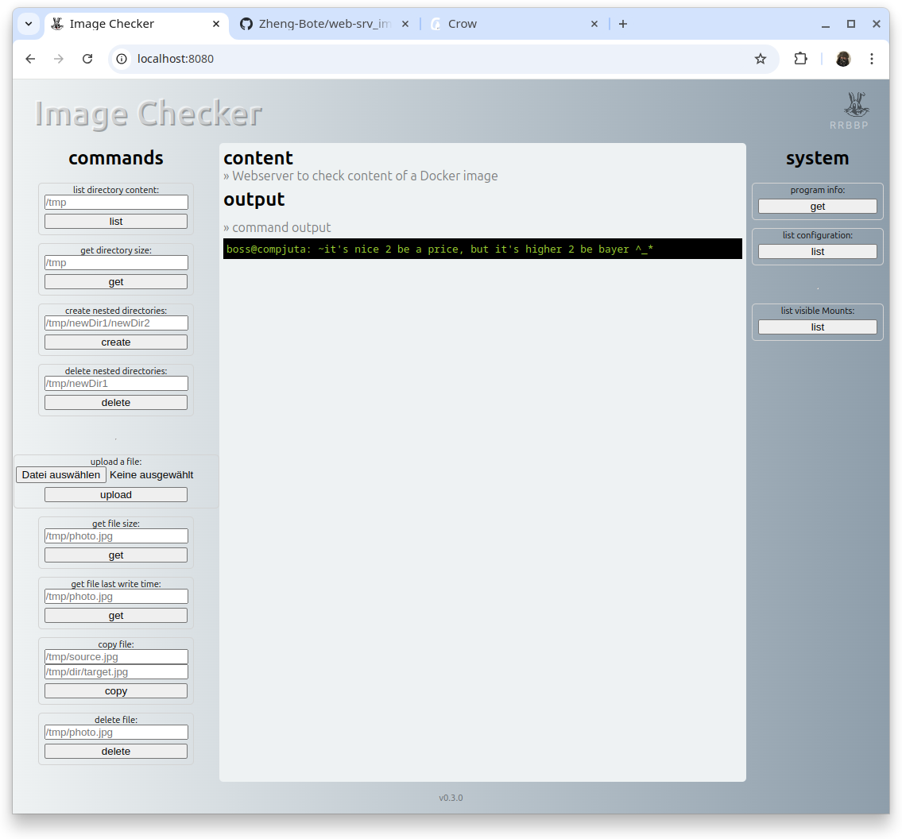
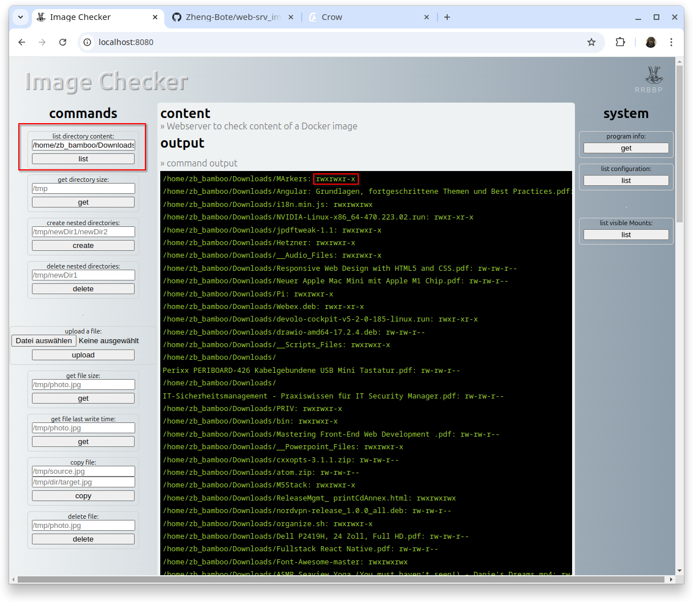
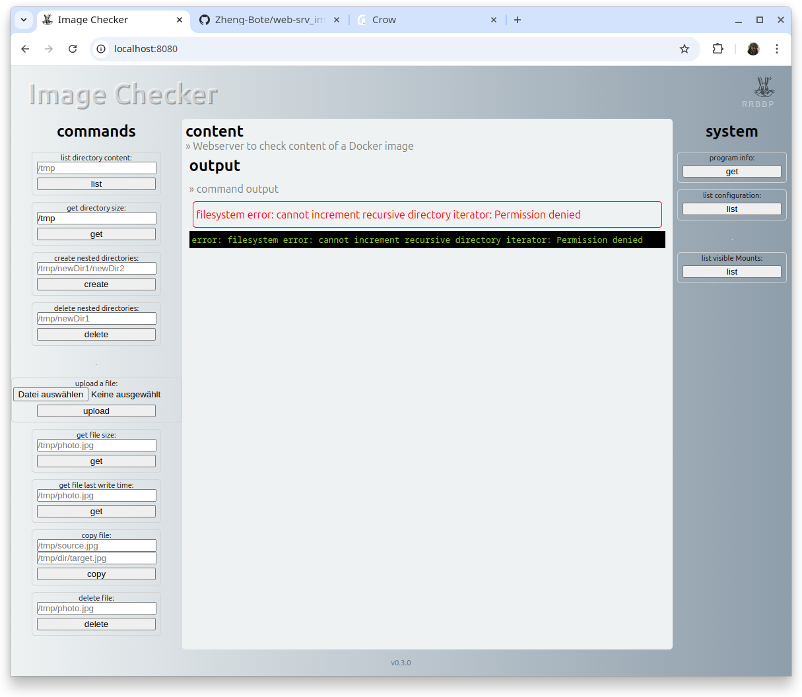
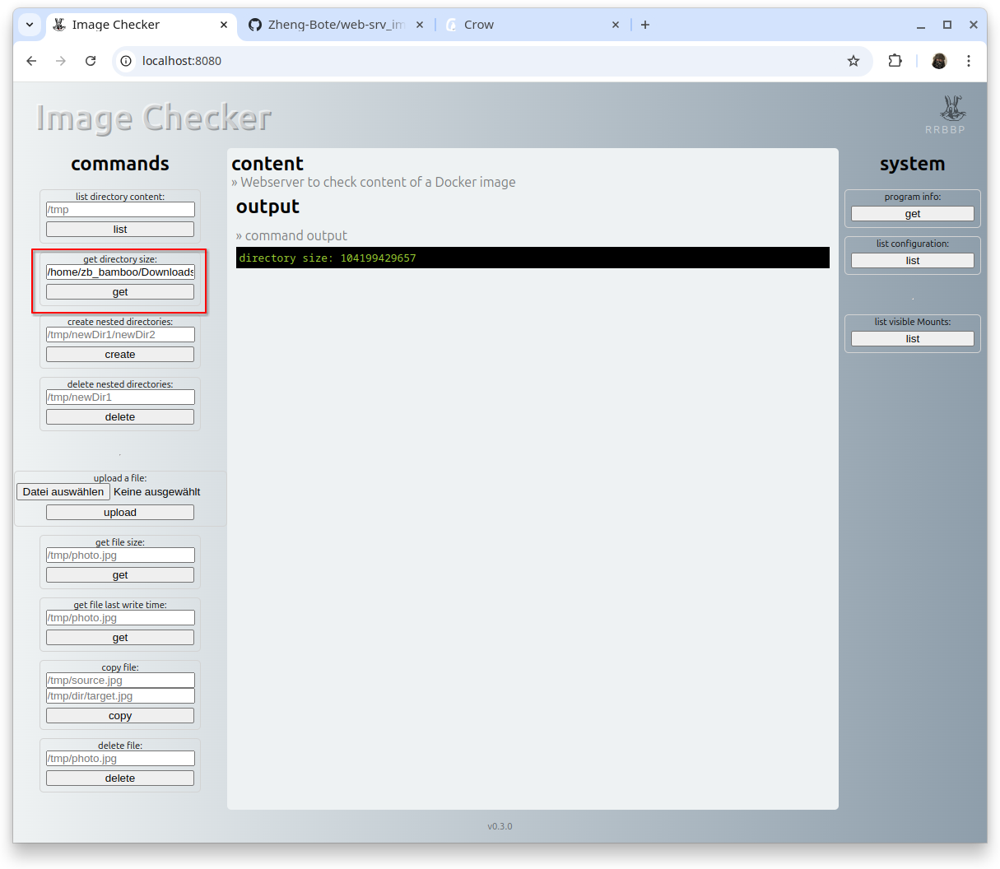
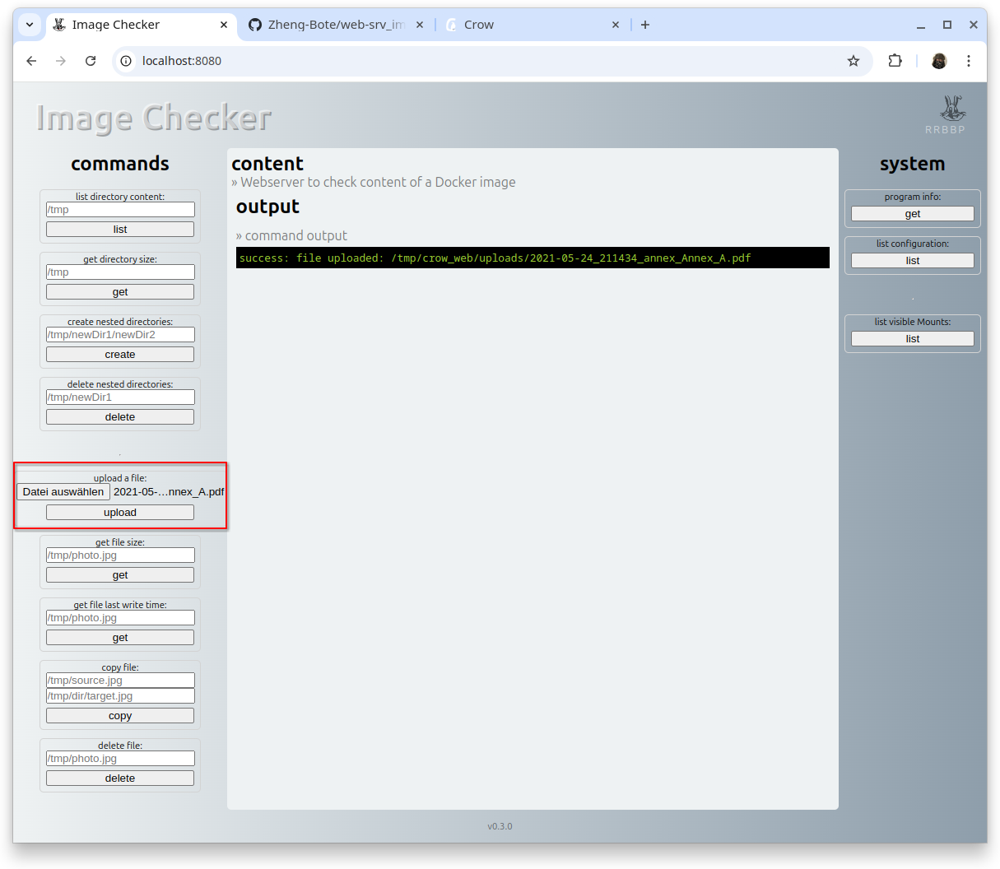
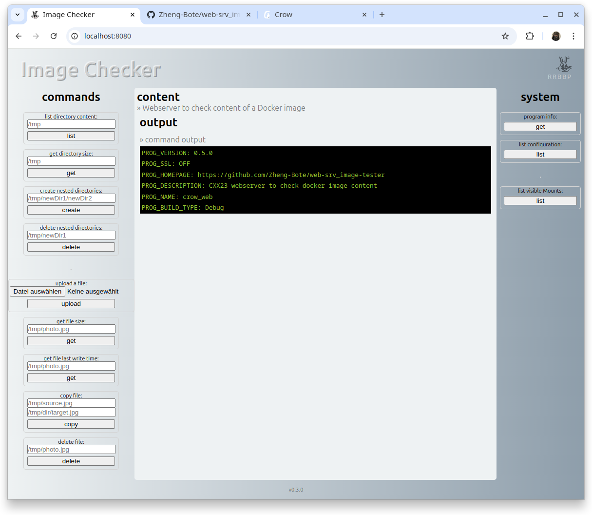
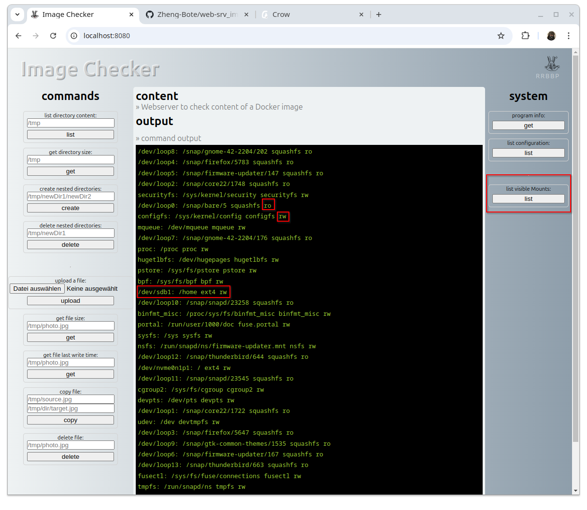

# Documentation

<!-- START doctoc generated TOC please keep comment here to allow auto update -->
<!-- DON'T EDIT THIS SECTION, INSTEAD RE-RUN doctoc TO UPDATE -->

**Table of Contents**

<!-- END doctoc generated TOC please keep comment here to allow auto update -->

## Screenshots

### Startpage

### list directory content with permissions

### failed command / example error message

### get directory size

### upload a file

### crow_web program info

### list program (inifile) configuration

### list visible mounts with permissions

